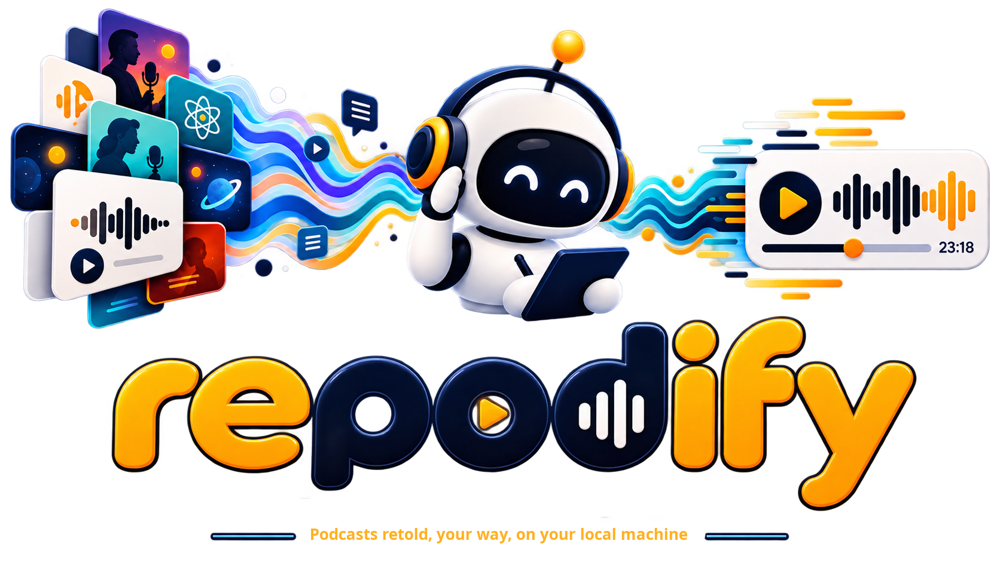

<p align="center">
  
</p>

# Repodify

**Turn a stretch of a podcast into one tailored ~30-minute digest episode.**

Paste a podcast link, pick the episodes you want, and Repodify downloads the
audio, transcribes it, summarizes it into a single chronological narrative,
writes a spoken script, and synthesizes a brand-new episode you can stream or
download — running **entirely on your own machine** or with **your own API keys
(BYOK)**, your choice at every step.

<p>
  
  
  
  
  
  <a href="LICENSE"></a>
</p>

> **Why this exists.** Suppose it's 2026, you're new to ML, and you want to learn
> the *history* of the field by listening to the podcasts that covered it as it
> happened — dozens of hours across dozens of episodes. Repodify condenses that
> archive into a single coherent episode that walks the story start to finish.
> Summarizing is only the first use case: the same pipeline is built to translate,
> augment, or otherwise re-voice a run of episodes into exactly the episode you want.

---

## Table of contents

- [Highlights](#highlights)
- [How it works](#how-it-works)
- [Quick start](#quick-start-one-command)
- [Backends: local vs BYOK](#backends-local-vs-byok)
- [Voices & job modes](#voices--job-modes)
- [The web app](#the-web-app-pwa)
- [Configuration](#configuration)
- [Development](#development)
- [Roadmap](#roadmap)
- [Architecture & docs](#architecture--docs)
- [Ethics & legal](#ethics--legal)
- [Contributing](#contributing)
- [License](#license)

---

## Highlights

- **One command to run the whole stack.** `./launch` syncs dependencies, builds
  the web app, starts Redis, and runs the API + worker + dev server together. It
  detects a CUDA GPU and picks real local backends, or walks you through a BYOK
  wizard when there's no GPU. Busy ports are remapped automatically.
- **Runs fully local, or bring your own keys.** Every ML stage — speech-to-text,
  diarization, summarization, and text-to-speech — can run on your GPU *or* on a
  hosted provider you supply a key for. Pick per stage, per job.
- **No key, no GPU? It still runs.** Fake backends produce a real end-to-end
  digest (silent audio, placeholder text) so the app — and its full test suite —
  runs on CPU with no network.
- **Resumable, gated pipeline.** The job pauses at each ML stage so you can choose
  local vs BYOK, model size, target length, and voices. Choices and progress are
  checkpointed to SQLite — shut the app down at a gate and resume later.
- **Speaker-aware.** Optional diarization figures out who spoke, clusters the same
  host/guest across episodes, and can voice the digest as the show's real cast.
- **Opt-in voice cloning with guardrails.** Clone the original hosts' voices —
  always labeled synthetic, with a spoken disclaimer and an inaudible watermark.
- **A polished PWA.** A React 19 + Vite web client, served same-origin by the API,
  drives the whole flow and streams the finished audio (with seek/scrub).

---

## How it works

```
  paste link ─▶ search / resolve RSS ─▶ pick episodes (oldest-first)
        │
        ▼
   download ─▶ transcribe ─▶ [diarize] ─▶ summarize ─▶ arc ─▶ script ─▶ TTS ─▶ assemble
              (STT)          (who spoke)   map          reduce   spoken   speak   digest.wav
                                                                                  digest.mp3
                                                                                  show notes
```

Repodify is a **backend service**, not a CLI: a **FastAPI** app enqueues jobs onto
a **Redis/arq** queue, and a separate **worker** runs the pipeline. The pipeline
itself is a **LangGraph** `StateGraph` where each heavy stage sits behind a small
**port** (protocol) with a real adapter and a test fake — which is exactly what
lets the whole thing run on CPU in tests.

The graph **pauses at a gate** before each ML stage (`transcribe → diarize →
voices → summarize → tts`). At each gate the client submits a small payload —
*run this locally or BYOK, at this model size, targeting this length, with these
voices* — and the worker resumes from a durable SQLite checkpoint. Progress is
polled via `GET /jobs/{id}`; the worker writes per-stage state as it goes.

Read the full [**system architecture reference**](docs/architecture.md) for the
job lifecycle, the ports/adapters seams, persistence, GPU/VRAM management, and the
deployment topology.

---

## Quick start: one command

```bash
./launch          # or: make run
```

That's it. `./launch`:

- syncs Python deps (with the `[gpu]` extra when a GPU is present) and web deps,
- builds `web/dist/` and serves it from the API at `/app`,
- starts Redis (and Postgres with `--postgres`),
- runs the API, the worker, and the Vite dev server together,
- **auto-detects the run mode**: a CUDA GPU → real local backends; no GPU → a
  short BYOK setup wizard.

| Flag | Effect |
|---|---|
| _(none)_ | Auto-detect GPU → real local, else BYOK wizard |
| `--fake` | Keyless CPU dev run — instant, no models, no network |
| `--real` | Force real mode even if GPU detection is inconclusive |
| `--postgres` | Also start Postgres and point the app at it |
| `--help` | Usage |

When it's up you'll see the URLs it chose (ports are remapped if busy):

```
  repodify is up — mode: real-gpu
  ------------------------------------------------------------
  API           http://localhost:8000
  Built app     http://localhost:8000/app/
  Vite dev      http://localhost:5173/app/
  Redis         localhost:6379
```

Press **Ctrl-C** to stop the app processes (Redis keeps running; `make stop`
halts the containers).

### Requirements

- [**uv**](https://docs.astral.sh/uv/) for Python deps & environments.
- **Python 3.13** (pinned in `.python-version`; uv installs it). `>=3.12` works.
- **Node.js 20+** and npm for the web client.
- **Docker or Podman** for Redis (and optional Postgres).
- **ffmpeg** on `PATH` for real runs (mp3 transcode + reference-clip extraction).
- For **real local** STT/TTS/diarization: a **CUDA GPU** and the `[gpu]` extra
  (`torch`, `faster-whisper`, `f5-tts`, `kokoro`, `pyannote.audio`, `audioseal`).
  Validated on an 8 GB RTX 4060 — see [GPU notes](docs/architecture.md#11-gpu--resource-management).

---

## Backends: local vs BYOK

Each ML stage is a swappable backend. Choose **Local** (runs on your hardware) or
**BYOK** (a hosted provider, using a key you supply) — globally in Settings, or
per stage at each gate.

| Stage | Local (on your GPU/CPU) | BYOK (hosted, your key) |
|---|---|---|
| **Transcribe (STT)** | `faster-whisper` | OpenRouter `/audio/transcriptions` |
| **Diarize** | `pyannote.audio` (needs `HF_TOKEN`) | pyannoteAI |
| **Summarize / script (LLM)** | Ollama | Anthropic (Claude) · OpenRouter |
| **Text-to-speech** | F5-TTS (cloned) + Kokoro (stock catalog) | OpenRouter `/audio/speech` |

Keys live in `.env` or in the web **Settings** page and are **never stored on a
job**. `GET /settings` only ever returns `*_configured` boolean flags, never the
secret values themselves. Settings you pick in the UI are persisted in an
`app_settings` table and **override** the corresponding `.env` defaults per field.

**Fully keyless paths exist too:** run everything local on a GPU, use Ollama for
the LLM so you need no cloud key at all, or run `--fake` for a CPU dev loop.

---

## Voices & job modes

How the digest is *voiced* is decided at the diarize and voices gates:

| Mode | How you get it | Behaviour |
|---|---|---|
| **Single narrator** | diarize gate → assign voices **off** | One narrator/stock voice reads the whole digest. No diarization. |
| **Original cast (cloned)** | voices gate → **original** | Diarization detects each speaker; each is cloned from the source audio (F5-TTS). |
| **Stock replacements** | voices gate → **replace** | Each detected speaker is voiced by a gender-matched catalog voice (Kokoro), or a specific one you assign. |
| **Speaker-preserving** | `preserve_speakers` | The script becomes a multi-speaker dialogue attributed to the real detected cast, each in their assigned (clone or stock) voice. |

The **stock catalog** is browsable at `GET /voices` (each voice has a playable
sample and a gender tag); you can curate your preferred voices in Settings. When
diarization is on, speakers are **clustered across episodes** by voice embedding
so the same host/guest maps to one voice, and stock voices are **matched to each
speaker's gender** (inferred from pitch) by default.

### Voice-cloning guardrails (always enforced)

Cloning is **opt-in and off by default**. Whenever any voice is cloned, three
guardrails are applied and cannot be turned off:

1. **Labeled synthetic** — the show notes carry `synthetic: true` + a disclaimer.
2. **Spoken disclaimer** — an audible AI disclaimer (configurable via
   `CLONE_DISCLAIMER`) is prepended to the audio, in a non-cloned voice.
3. **Inaudible watermark** — the output is watermarked (AudioSeal in real mode).

> Only clone voices you have the right to use. See [Ethics & legal](#ethics--legal).

---

## The web app (PWA)

A React 19 + Vite + Tailwind + TanStack Query PWA lives in [`web/`](web/) and is
served same-origin by the API at `/app` (client-side router `basename="/app"`).
It has four screens: **Overview**, **New digest** (search → pick episodes →
configure → track gates), **History**, and **Settings** (Local + BYOK models,
API keys, and preferred stock voices).

```bash
cd web
npm install        # once
npm run dev        # dev server on :5173, proxies API calls to :8000
npm run build      # emit web/dist/, which the API serves at /app
npm test           # Vitest + MSW component/hook tests
```

Open `http://localhost:8000/app/` (built) or the Vite dev server during
development. If the API is protected by `API_TOKEN`, set the token in **Settings**.

---

## Configuration

All configuration is environment-driven via `pydantic-settings`. Copy the example
and edit it:

```bash
cp .env.example .env
```

The most useful knobs (see [`.env.example`](.env.example) for the full, commented
list, and the [architecture reference](docs/architecture.md#13-configuration) for
every setting):

| Setting | Default | Purpose |
|---|---|---|
| `USE_FAKES` | `true` | Fakes for STT/LLM/TTS — CPU-only, no network. Set `false` on a GPU host. |
| `LLM_BACKEND` | `anthropic` | `anthropic` · `ollama` · `openrouter`. |
| `TTS_BACKEND` | `f5` | `f5` (local F5-TTS + Kokoro) · `openrouter` (hosted). |
| `WHISPER_MODEL` | `large-v3`¹ | faster-whisper size (`small` fits 8 GB beside F5-TTS). |
| `DATABASE_URL` | SQLite `./data/app.db` | Metadata store; Postgres in prod. |
| `REDIS_URL` | `redis://localhost:6379` | arq job queue. |
| `API_TOKEN` | _unset_ | When set, a bearer token is required on every route but `/health`. |
| `ANTHROPIC_API_KEY` / `OPENROUTER_API_KEY` / `PYANNOTEAI_API_KEY` / `HF_TOKEN` | _unset_ | BYOK credentials. |

> ¹ `config.py`'s unset default is `large-v3` (most accurate); `.env.example` and
> the `./launch` wizard set `small`, which fits alongside F5-TTS on an 8 GB card.
> This is deliberate — don't "fix" one to match the other without checking VRAM.

Relative `DATA_DIR` and SQLite `DATABASE_URL` are **anchored to the project root**,
not the process working directory, so the API, worker, and any ad-hoc run share
one database and data directory.

---

## Development

```bash
uv sync                          # core + dev deps from uv.lock
uv sync --extra gpu              # CUDA host only — real STT/TTS/diarization
uv run pytest                    # CPU, no network; STT/LLM/TTS are faked
uv run ruff check src tests
uv run ruff format src tests

cd web && npm test               # Vitest + MSW
cd web && npm run lint           # tsc -b
cd web && npm run build          # web/dist/, served by the API at /app
```

The default test suite runs the **entire pipeline and API on CPU** with no
network, GPU, or ffmpeg — HTTP is mocked with `respx`, and every ML dependency
sits behind a fake in `ports/`. That's the load-bearing convention of the
codebase; see [`AGENTS.md`](AGENTS.md) and [`CONTRIBUTING.md`](CONTRIBUTING.md).

### Repository layout

| Path | Role |
|---|---|
| `src/repodify/api/` | FastAPI app, auth, request/response schemas, Range audio |
| `src/repodify/worker/` | arq worker + `build_deps` composition root + `run_pipeline` |
| `src/repodify/pipeline/` | LangGraph graph, node closures, gates, `Deps`, state, checkpointer |
| `src/repodify/ports/` | Port protocols **and** their fakes (STT, LLM, TTS, diarizer, cloner, watermarker, transcoder) |
| `src/repodify/ingest/` | Link → RSS resolvers, directory search (iTunes / Podcast Index), feed parsing, download |
| `src/repodify/transcribe/` | faster-whisper + OpenRouter STT, pyannote + pyannoteAI diarization, cross-episode clustering |
| `src/repodify/summarize/` | map/reduce LLM chains, prompts, custom-guidance layering |
| `src/repodify/script/` | budget-aware script writer |
| `src/repodify/synth/` | F5-TTS, Kokoro, OpenRouter TTS, routing, assembly, transcode, cloning, watermark, gender/pitch |
| `src/repodify/persistence/` | `JobRepository`, `SettingsRepository`, engine — the only DB access |
| `src/repodify/models/` | pydantic domain (`domain.py`), SQLAlchemy (`db.py`), enums |
| `src/repodify/storage/` | `Storage` port + filesystem implementation |
| `src/repodify/config.py` | pydantic-settings, project-root-anchored paths |
| `web/` | React + Vite PWA (`basename=/app`) |
| `tests/unit/` · `tests/integration/` · `tests/launch/` | unit (mirrors src), full-graph, and launcher tests |

### Try the HTTP API directly

With the service running in fake mode (`docker compose up -d` then the API and
worker), the flow is search → resolve → create job → step through gates → fetch:

```bash
# 1. Search shows by name (or paste an RSS / Apple URL as q).
curl -s "localhost:8000/feeds/search?q=Linear%20Digressions"

# 2. Resolve the chosen feed_url and list episodes (live RSS, full archive).
curl -s -X POST localhost:8000/feeds/resolve \
  -H 'content-type: application/json' -d '{"url": "https://example.com/feed.xml"}'

# 3. Create a job for the episodes you want (oldest-first).
curl -s -X POST localhost:8000/jobs \
  -H 'content-type: application/json' \
  -d '{"feed_url": "https://example.com/feed.xml", "episode_ids": ["ep-1","ep-2"]}'

# 4. The job pauses at each gate. Continue, e.g. transcribe locally:
curl -s -X POST localhost:8000/jobs/<job_id>/continue \
  -H 'content-type: application/json' \
  -d '{"gate": "transcribe", "payload": {"mode": "local", "model": "small"}}'

# 5. Poll status, then fetch the result and stream the audio (supports Range).
curl -s localhost:8000/jobs/<job_id>
curl -s localhost:8000/jobs/<job_id>/result
curl -s -o digest.mp3 "localhost:8000/jobs/<job_id>/audio?format=mp3"
```

When `API_TOKEN` is set, add `-H "Authorization: Bearer $API_TOKEN"` to every
request except `GET /health`.

---

## Roadmap

- [ ] **Speaker name extraction** — identify the real host/guest names from the
  podcast (audio + episode metadata) and label the digest cast with them, instead
  of the diarization ids (`SPEAKER_00`).
- [ ] **Human-readable job names** — name each job after its brief/prompt instead
  of the current hash-digest id.
- [ ] **Bullet-proof retry on limit hit (BYOK)** — resilient retry/back-off when a
  hosted provider returns a rate-limit or quota error, so a long job survives it.
- [ ] **Translation** — render the digest in the user's language of choice.
- [ ] **Search in podcast contents** — search ingested transcripts so users can
  find and listen to topics of their choice, not only a pre-picked episode range.
- [ ] **Telegram bot** — a TG bot front-end to request a digest and receive the
  finished episode.

---

## Architecture & docs

- [**System architecture reference**](docs/architecture.md) — the whole system:
  components, job lifecycle, pipeline, ports/adapters, persistence, HTTP API,
  settings overrides, GPU/VRAM management, and deployment.
- [**AGENTS.md**](AGENTS.md) — the working agreement: invariants agents (and
  humans) must not violate, and the day-to-day command set.
- [**CONTRIBUTING.md**](CONTRIBUTING.md) — how to set up, test, and open a PR.
- [`docs/superpowers/specs/`](docs/superpowers/specs/) and
  [`docs/superpowers/plans/`](docs/superpowers/plans/) — the per-feature designs
  and build plans, in the order they were shipped.

---

## Ethics & legal

Voice cloning can impersonate real people. Repodify treats that as a first-class
constraint, not an afterthought:

- Cloning is **off by default** and **opt-in**.
- Cloned output is **always** labeled synthetic, carries a **spoken disclaimer**,
  and is **watermarked** — there is intentionally no code path that clones without
  these guardrails.
- **Only clone voices you have the right to use.** Respect right-of-publicity and
  each platform's terms of service.

This project is intended for **personal, local, and educational** use — condensing
podcast archives you have access to into a study aid. It is not a tool for passing
synthetic audio off as a real person.

---

## Contributing

Contributions are welcome. Start with [`CONTRIBUTING.md`](CONTRIBUTING.md) for
setup and the PR workflow, and [`AGENTS.md`](AGENTS.md) for the architectural
rules the codebase depends on. In short: work on a feature branch, keep the
default test suite GPU/network-free, put new ML/hosted backends behind a port +
fake, and open one PR per logical unit.

---

## License

Repodify is released under the [MIT License](LICENSE). © 2026 Behrad Khodayar.
