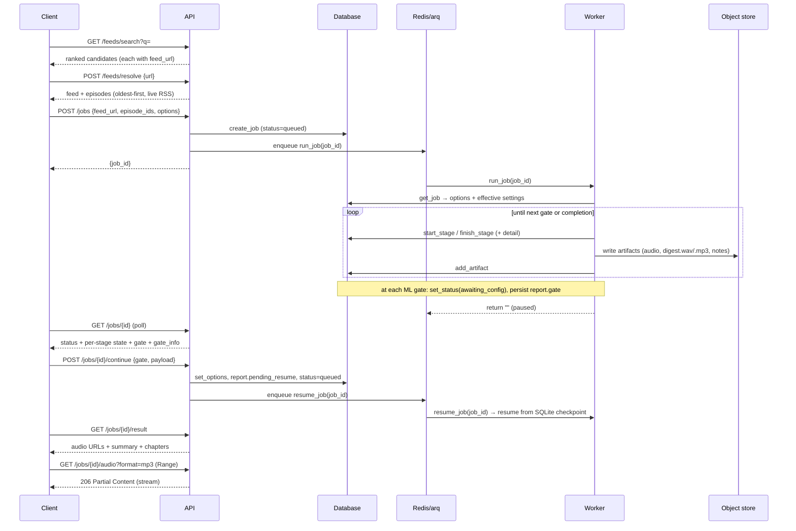
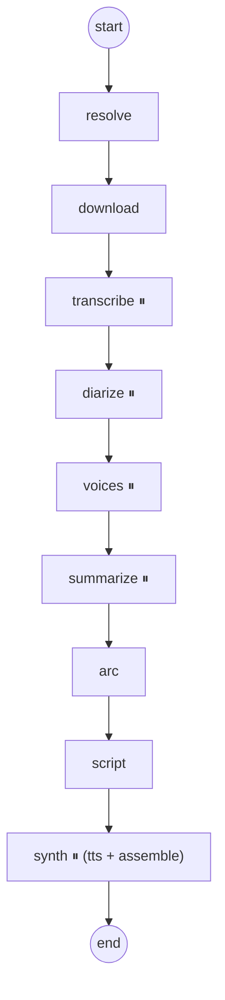

# Repodify — System Architecture Reference

A detailed, whole-system reference for how Repodify is built: its components, the
job lifecycle, the processing pipeline, the ports/adapters seams, the runtime
settings/BYOK model, persistence, the HTTP API, configuration, the web client,
the execution model, and deployment.

For the narrative overview and quickstart, see the [README](../README.md). For the
per-feature designs and build plans, see [`superpowers/specs/`](superpowers/specs/)
and [`superpowers/plans/`](superpowers/plans/). For the invariants contributors
must not violate, see [`AGENTS.md`](../AGENTS.md).

---

## 1. Purpose & scope

Repodify turns a podcast — or a chosen chronological stretch of it — into a single
digest episode tailored to what the user wants. A user pastes a podcast link,
picks which episodes to include (oldest-first), and the service:

1. searches for a show by name (or accepts a pasted RSS / Apple URL), resolves the
   live RSS `feed_url`, and lists episodes,
2. downloads the selected episodes' audio,
3. transcribes them (speech-to-text),
4. optionally diarizes them (who spoke when) and clusters the same speaker across
   episodes,
5. summarizes each episode (LLM "map"),
6. synthesizes a single chronological narrative arc across them (LLM "reduce"),
7. writes a spoken script sized to a target duration (or "smart" length),
8. synthesizes narration with text-to-speech, and
9. assembles a `digest.wav` + a compressed `digest.mp3` plus show notes (summary +
   chapter markers).

It is a **backend service with an HTTP API**, not a CLI. The defining design goal
is **user control at every seam**: each ML stage can run **locally** (on the
user's GPU/CPU) or **BYOK** (a hosted provider, with a key the user supplies), and
the whole app runs on CPU with **fakes** for tests and keyless dev. Summarization
is the first use case; the same pipeline is built to translate, augment, or
re-voice a run of episodes (see the [Roadmap](../ROADMAP.md)).

---

## 2. High-level architecture

```mermaid
flowchart LR
    subgraph clients[Clients]
        web[Web PWA]
        mobile[Mobile / API consumers]
    end

    subgraph api[FastAPI service]
        direction TB
        auth[Bearer-token auth]
        routes[Routes: feeds, jobs, voices, settings, audio, health]
    end

    redis[(Redis / arq queue)]
    db[(SQL DB: SQLite dev / Postgres prod)]
    fs[(Object store: local filesystem / S3 later)]

    subgraph worker[arq worker]
        graph[LangGraph pipeline]
    end

    web & mobile -->|HTTPS + Bearer| api
    api -->|create job / read settings| db
    api -->|enqueue job_id| redis
    api -->|stream WAV/mp3| fs
    redis --> worker
    worker -->|read job/options + settings| db
    worker -->|per-stage progress + artifacts| db
    worker -->|write audio, transcripts, outputs| fs
    api -->|poll status / result| db
```

**Two processes, shared state.** The API and the worker are separate processes
that never call each other directly — they communicate through the **queue**
(hand off a `job_id`), the **database** (job/stage/artifact/settings state), and
the **object store** (audio + outputs). This lets the long, GPU-bound pipeline run
independently of request/response latency, and lets the API stay a thin, stateless
HTTP layer.

Composition roots wire the two processes:

- **API:** `api/app.py:create_app` (injectable) / `build_default_app`
  (`uvicorn --factory`).
- **Worker:** `worker/main.py:build_deps` / `run_pipeline` / `run_review_digest`.

---

## 3. Job lifecycle



Progress is **polled**, not pushed: the worker persists per-stage state as it goes,
and clients read `GET /jobs/{id}`. There is intentionally no SSE/WebSocket
(single-user MVP; a push channel is additive since state is already persisted).

`JobStatus` moves `queued → running → completed | failed`, pausing at
`awaiting_config` at each gate. (`awaiting_review` is a retained alias treated the
same as `awaiting_config`.)

---

## 4. The processing pipeline

The pipeline is a LangGraph `StateGraph` compiled from node closures over a `Deps`
container (`pipeline/graph.py`, `pipeline/nodes.py`). It is **linear**:



Node order is `resolve → download → transcribe → diarize → voices → summarize →
arc → script → synth` (`pipeline/graph.py:_ORDER`). Nodes marked ⏸ call LangGraph
`interrupt()` (via `_take_gate`) so the worker can persist a SQLite checkpoint and
wait at `awaiting_config`; the client resumes with `POST /jobs/{id}/continue`.
`synth` runs both the `tts` and `assemble` stages. The `voices` node is
**gate-only** (it collects voice assignments; it produces no stage row of its own).
`StageName.LIST` exists for an interactive selection step but is unused — selection
happens at job creation via `episode_ids`.

Data threaded through the graph (`pipeline/state.py:PipelineState`):

| Stage | Gate? | Input | Output (state key) | Notes |
|---|---|---|---|---|
| resolve | — | `feed_url`, `episode_ids` | `feed`, `selected` | resolver → RSS fetch → parse → filter to selected (fails if none match) |
| download | — | `selected` | `downloaded` | per-episode; failures append to `report.skipped` and are skipped |
| transcribe | ✅ | `downloaded` | `transcripts` | per-episode STT; releases the STT model's VRAM after |
| diarize | ✅ | `transcripts` | `transcripts` (speaker-labeled), `cast` | who-said-what; **cross-episode clustering** + **gender inference**; skipped when no voice feature is requested |
| voices | ✅ | `cast` | `report.speakers` | pauses so the user assigns a voice per detected speaker |
| summarize | ✅ | `transcripts` | `summaries` | LLM **map**, one `EpisodeSummary` per episode; applies custom/episode prompts |
| arc | — | `summaries` | `arc` | LLM **reduce** → one `ArcOutline` |
| script | — | `arc`, `options`, `cast` | `script` | budget-aware; `smart` or `manual` length; multi-voice cast when `preserve_speakers` |
| synth | ✅ (tts) | `script`, `arc`, `cast` | `output_uri` | resolve each speaker→voice (clone/stock) → TTS → assemble WAV → watermark (if cloned) → transcode mp3 → show notes |

**Diarization detail.** When a voice feature is on, each episode is diarized, then
`unify_speakers_across_episodes` merges the same speaker across episodes by voice
embedding (cosine threshold `cross_episode_speaker_threshold`). Each cast member's
vocal **register is estimated from median pitch** and mapped to a `gender`, so
stock voices can be gender-matched by default.

**Voice resolution at synth.** For a speaker-preserving digest, each cast id is
resolved to a voice: an explicit assignment wins; otherwise a same-gender stock
voice (falling back to register-interleaved catalog voices to keep them distinct);
`clone` mode cuts a reference clip from the episode where that speaker talks most
and hands it to F5-TTS. Any cloned voice triggers the guardrails (§10).

**Custom editorial guidance.** `JobOptions.custom_prompt` (whole digest) and
`episode_prompts` (per episode guid) are layered onto the built-in prompts via
`summarize/guidance.py:runtime_guidance` and applied at the map/reduce/script
stages. Cap is `MAX_PROMPT_CHARS` (4000).

**Resilience.** Per-episode download/transcribe errors append to `report.skipped`
and the run continues; a stage only fails if *every* episode fails. Each node wraps
its work in `start_stage`/`finish_stage`, so a failure is recorded against the
exact stage before the exception propagates and the job is marked `failed`.

**Checkpointing.** The worker compiles the graph with a **SQLite saver**
(`pipeline/checkpoint.py`, `{DATA_DIR}/checkpoints.db`) so a gate survives process
restart; in-process tests use the default in-memory `MemorySaver`.

---

## 5. Ports & adapters

Every external or heavy dependency sits behind a small `Protocol` **port** with a
real adapter and a test **fake**. This is what lets the entire pipeline run on CPU
with no network, GPU, or ffmpeg in the test suite, and what isolates provider SDKs
from the pipeline logic.

| Port (protocol) | Method(s) | Real adapter(s) | Fake |
|---|---|---|---|
| `Resolver` | `matches`, `resolve` | `Apple` / `Castbox` / `RawRss` resolvers (registry) | (registry; no fake needed) |
| `Transcriber` (STT) | `transcribe(path) -> Transcript`, `release()` | `FasterWhisperTranscriber` (local) · `OpenRouterTranscriber` (BYOK) | `FakeTranscriber` |
| `Diarizer` | `diarize(path) -> [SpeakerTurn]`, `release()` | `PyannoteDiarizer` (local) · `PyannoteCloudDiarizer` (BYOK) | `FakeDiarizer` |
| `StructuredLLM` | `generate(system, user, schema) -> BaseModel` | `AnthropicStructuredLLM` · `OllamaStructuredLLM` · `OpenRouterStructuredLLM` | `FakeStructuredLLM`, `LocalStubLLM` |
| `TTS` | `synthesize(text, voice) -> wav bytes`, `release()` | `RoutingTTS` → `F5TTS` (cloned) / `KokoroTTS` (stock) · `OpenRouterTTS` (BYOK) | `FakeTTS` (silent WAV sized to word count) |
| `VoiceCloner` | `clone(audio, transcript, keys, storage, job_id) -> {key: Voice}` | `ClipVoiceCloner` (cuts clips from the labeled transcript) | `FakeVoiceCloner` |
| `Watermarker` | `embed(wav) -> wav` | `AudioSealWatermarker` | `FakeWatermarker` (no-op) |
| `Transcoder` | `to_mp3(src_wav, dst_mp3)` | `FfmpegTranscoder` (subprocess ffmpeg) | `FakeTranscoder` (stub bytes) |
| `Storage` | `put_bytes/get_bytes/put_file/local_path/exists` | `FilesystemStorage` | (real fs under `tmp_path` in tests) |

Ports and their fakes live in `ports/` (and `storage/base.py`); real ML adapters
live in `transcribe/`, `synth/`, and `ports/llm.py`. **GPU models expose
`release()`** so the pipeline can free one model's VRAM before loading the next
(see §9).

Convention: a port's `Protocol` and its `Fake*` sit together in `ports/`; the real
adapter lives next to its domain (`transcribe/faster_whisper.py`, `synth/f5_tts.py`,
`synth/transcode.py`, …). Real/heavy SDKs are **lazy-imported inside the adapter**,
never at package import — so `USE_FAKES=true` (and `./launch --fake`) needs no
`[gpu]` extra.

---

## 6. Domain model

The pydantic models in `models/domain.py` are the vocabulary that flows through the
pipeline (distinct from the SQLAlchemy persistence models in `models/db.py`):

- **`Episode` / `Feed`** — parsed RSS; episodes are oldest-first with an
  `order_index` and an `is_short_or_trailer` flag.
- **`Candidate`** — a directory search hit (title, `feed_url`, artwork,
  iTunes / Podcast Index ids). Directory-specific ids stay here so the episode
  picker never sees them.
- **`Transcript` / `TranscriptSegment`** — time-stamped STT output; a segment's
  `speaker` is the diarization label once labeled. `.text`, `.speaker_labeled_text`,
  and `.speaker_labeled_text_timestamped()` render it for the LLM.
- **`Speaker`** — a distinct diarized voice (`id`, optional `label`,
  `speaking_seconds`, inferred `gender`).
- **`EpisodeSummary`** — the map-step output (key points, themes, quotes, timeline
  markers).
- **`ArcOutline` / `ArcBeat`** — the reduce-step chronological through-line.
- **`Script` / `ScriptSegment`** — speaker-attributed spoken text; `.word_count`
  and `.estimated_minutes(wpm)` drive budget sizing.
- **`ShowNotes` / `Chapter`** — the human-readable output (summary + chapter
  markers; `synthetic` flag + `disclaimer` for cloned output).
- **`VoiceAssignment`** — how one detected speaker is voiced: `mode="clone"` (their
  own voice) or `mode="stock"` (a named catalog voice).
- **`ExecutionChoice`** — a per-stage local-vs-BYOK selection (`mode`, `model`,
  optional LLM `backend`).
- **`JobOptions`** — the full per-run configuration: `episode_ids`, `host_count`,
  `clone`, `target_minutes` / `length_mode`, `preserve_speakers`, `review_voices`,
  `assign_voices`, `use_original_voices`, per-stage `transcribe`/`diarize`/`llm`/`tts`
  choices, `narrator_voice`, `voice_assignments`, and the editorial `custom_prompt`
  / `episode_prompts`.

---

## 7. Persistence & job state

SQLAlchemy models (`models/db.py`), accessed only through repositories
(`persistence/`) so the pipeline and API never touch sessions directly:

- **`Job`** — `id`, `feed_url`, `status`, `current_stage`, `options_json`,
  `report_json`, `created_at`, `finished_at`.
- **`StageStatus`** — one row per stage attempt: `stage`, `state`, `detail`,
  `started_at`, `finished_at`.
- **`Artifact`** — produced files: `kind`, `uri`, optional `episode_guid`.
- **`AppSetting`** — a `(key, value)` row for persisted app settings. It is
  intentionally key/value (not typed columns) so new settings need **no migration**:
  the app has no Alembic and `create_all` only adds missing tables, not columns.

`JobRepository` (`persistence/repo.py`) methods: `create_job`, `get_job`
(eager-loads stages/artifacts then detaches), `list_jobs(limit, offset) ->
(jobs, total)`, `set_status`, `start_stage`/`finish_stage`/`update_stage_detail`,
`add_artifact`, `set_report`, `set_options`. `StageState` is `pending → running →
done | skipped | failed`.

`SettingsRepository` (`persistence/settings_repo.py`) reads/writes `AppSetting`
rows for the runtime overrides (§8). The engine is created from `DATABASE_URL` —
**SQLite** for local dev (`sqlite:///./data/app.db`), **Postgres** for production
(`postgresql+psycopg://…`). `init_db` creates tables from the metadata.

---

## 8. Runtime settings, local vs BYOK

Configuration has **three layers**, resolved per field, lowest to highest priority:

1. **Defaults** in `config.py` (pydantic-settings).
2. **`.env` / environment** overrides.
3. **Persisted overrides** in `app_settings`, set from the web **Settings** page.

`SettingsRepository.get_overrides()` returns the persisted key/values;
`apply_overrides(settings, overrides)` layers them onto a `Settings` copy per field
(`persistence/settings_repo.py`). Both composition roots apply them — the API for
its `_effective()` view, and the worker inside `build_deps`. Secrets
(`openrouter_api_key`, `anthropic_api_key`, `pyannoteai_api_key`, `hf_token`) can be
stored here but are **never returned** by `GET` endpoints — only `*_configured`
booleans are.

**LLM resolution** is factored into `ports/llm.py:effective_llm(settings,
overrides)`, which returns an `EffectiveLlm` (backend + the model ids for each
provider). `LlmOverrides` carries the user-picked `llm_backend` /
`openrouter_llm_model` / `ollama_model`; a `None` field falls back to `.env`.

**Per-job backend selection.** `JobOptions` carries an `ExecutionChoice` per ML
stage, filled in at each gate. `worker/main.py:apply_job_backends` swaps the wired
adapter for the job's choice (e.g. BYOK transcription → `OpenRouterTranscriber`,
local diarization → `PyannoteDiarizer`) — but only in real mode; fake mode is left
untouched so tests and `./launch --fake` stay offline. The API validates that the
required key is configured before enqueueing a BYOK continue (`_require_byok_key`).

---

## 9. Ingest & directory search

`ingest/` turns a user's input into a resolved feed and its episodes:

- **Search** (`search.py`, exposed at `GET /feeds/search`) accepts a show name, an
  Apple id, or a pasted RSS/Apple URL and returns ranked `Candidate`s. It queries
  the **iTunes Search API** (zero-config) and, when keys are present, the
  **Podcast Index** — de-duplicating by identity (`normalize.py`). Results are
  cached (`cache.py`, a JSON cache under `DATA_DIR/cache`); a degraded upstream is
  reported rather than fatal.
- **Resolve** (`resolvers.py`, `POST /feeds/resolve`) maps a `feed_url` (Apple,
  Castbox, or a raw RSS URL) to its live RSS URL, then `fetch.py` fetches it with
  **SSRF protection** (`SsrfBlocked` / `PrivateFeedError` guard against
  internal/private targets) and `feed.py` parses it into a `Feed` of oldest-first
  `Episode`s. With a Podcast Index write key, a resolved URL is submitted via
  `add/byfeedurl`.
- **Download** (`download.py`) streams each selected episode's audio into the
  object store with progress callbacks.

---

## 10. HTTP API surface

FastAPI app built by `create_app(repo, resolve_fn, http, enqueue, storage,
settings, static_dir=…, enqueue_resume=…, settings_repo=…, tts=…)` (`api/app.py`);
the composition root is `build_default_app` (`uvicorn --factory`). Every route
except `/health` is guarded by the bearer dependency (`api/auth.py`); CORS is
configured from `cors_allow_origins`.

| Method | Path | Purpose |
|---|---|---|
| GET | `/health` | Unauthenticated liveness probe |
| GET | `/feeds/search?q=` | Name / URL / Apple-id search → ranked candidates |
| POST | `/feeds/resolve` | Fetch live RSS for a `feed_url` → episodes |
| POST | `/jobs` | Create a job (`JobOptions`) and enqueue it |
| GET | `/jobs` | Paginated job history (`limit`, `offset`) |
| GET | `/jobs/{id}` | Status + per-stage state + current `gate` + `gate_info` (poll this) |
| POST | `/jobs/{id}/continue` | Submit a gate payload (`transcribe`/`diarize`/`voices`/`summarize`/`tts`); resumes the SQLite checkpoint |
| GET | `/jobs/{id}/speakers` | Detected cast for a voices gate |
| POST | `/jobs/{id}/voices` | Compatibility: submit voice assignments; resumes the job |
| GET | `/jobs/{id}/result` | `audio_mp3_url`, `audio_wav_url`, summary, chapters |
| GET | `/jobs/{id}/audio?format=mp3\|wav` | Range-streamed audio |
| GET | `/voices` | Stock (Kokoro) voice catalog, each with a sample URL + gender |
| GET | `/voices/{id}/sample` | A short WAV preview of a stock voice (generated on demand) |
| GET · PUT | `/settings` | Effective Local+BYOK config (secrets as `*_configured` flags) / partial update |
| GET · PUT | `/settings/llm` | LLM backend + models / update |
| GET · PUT | `/settings/voices` | Preferred stock voices / update |

Audio is served via Starlette `FileResponse`, which emits `Accept-Ranges` and
answers `Range:` with `206 Partial Content` (seek/scrub). Result/audio URLs are
**relative** so web and mobile clients just prefix their base URL. When
`static_dir` is present, `/` redirects to `/app/` and `/app/{path}` serves the
built PWA with a client-side-routing fallback.

**Error map:** `400` (SSRF-blocked URL / missing BYOK key), `401` (missing/bad
token), `404` (unknown job / missing rendition / unknown voice), `409`
(result/audio before completion, or continue when not at a gate), `416` (bad
Range), `422` (malformed body / unknown gate payload / private feed), `502`
(upstream feed fetch failed), `503` (settings store unavailable).

---

## 11. GPU & resource management

Real runs are GPU-bound and VRAM-constrained (validated on an 8 GB RTX 4060). Three
mechanisms keep peak VRAM to the single largest model rather than the sum:

- **Lazy load + `release()` between stages.** `FasterWhisperTranscriber`,
  `PyannoteDiarizer`, and the TTS backends load on first use; the pipeline calls
  `release()` in `finally` blocks after transcribe, after diarize, and after
  synthesis, and a shared `gpu.empty_cuda_cache()` drops cached blocks.
- **Ollama `keep_alive=0`.** The local LLM is unloaded from VRAM as soon as a call
  returns, instead of lingering the default five minutes.
- **CUDA-12 cuBLAS preload.** `FasterWhisperTranscriber` preloads the CUDA-12
  cuBLAS/runtime libraries so CTranslate2 works under a CUDA-13 PyTorch build with
  no `LD_LIBRARY_PATH` juggling. The `[gpu]` extra pins `nvidia-cublas-cu12` /
  `nvidia-cuda-runtime-cu12` for this.

On 8 GB, use `WHISPER_MODEL=small` (large-v3 will not fit beside F5-TTS). The
script writer under-budgets on small local models; a larger/general instruct model
narrates closer to the target length. Because the pipeline is the bottleneck,
workers scale with GPU availability while the API stays stateless.

---

## 12. Job modes

Job "mode" is not a single flag — it emerges from the choices made at the gates:

| Mode | How it is selected | Behaviour |
|---|---|---|
| **Single narrator** | diarize gate: `assign_voices=false` | Diarization skipped; one narrator/stock voice reads everything (chosen at the TTS gate). |
| **Original cast (cloned)** | voices gate: `use_original=true` | Every detected speaker is cloned from the source audio via `ClipVoiceCloner` → F5-TTS. Guardrails on. |
| **Stock replacements** | voices gate: `use_original=false` | Each speaker gets a gender-matched catalog voice (Kokoro), or a specific one assigned per speaker. |
| **Speaker-preserving** | `preserve_speakers=true` | The script is a multi-speaker dialogue attributed to the real detected cast, each in their assigned (clone/stock) voice. Overrides `host_count`. |
| **Two-host dialogue** | `host_count=2` | Two generic speakers `host_a`/`host_b`; each needs a stock reference clip in real mode. |
| **Per-stage local/BYOK** | every gate | Local GPU adapters or OpenRouter / pyannoteAI, chosen independently per stage. |

Gates persist across shutting the app down; a mid-stage crash resumes from the last
completed node. Hosted STT is OpenRouter `/audio/transcriptions`; hosted TTS is
OpenRouter `/audio/speech`; hosted diarization is pyannoteAI.

**Cloning guardrails (always enforced, non-optional):** the output is labeled
`synthetic: true` with a disclaimer in the show notes, a **spoken disclaimer** (in
a non-cloned voice) is prepended to the audio, and the audio is **watermarked**
(AudioSeal). Real cloning needs the `[gpu]` extra and an `HF_TOKEN` for pyannote.
There is intentionally no code path that clones without these.

---

## 13. Configuration

All config is environment-driven via pydantic-settings (`config.py`, `.env`), then
optionally overridden per field by the persisted `app_settings` (§8):

| Setting | Default | Purpose |
|---|---|---|
| `USE_FAKES` | `true` | Fakes for STT/LLM/TTS — CPU-only, no network. Set `false` on a GPU host. |
| `DATABASE_URL` | SQLite `./data/app.db` | Metadata store; Postgres in prod. |
| `REDIS_URL` | `redis://localhost:6379` | arq job queue. |
| `DATA_DIR` | `data` | Root of the object store (project-root-anchored). |
| `API_TOKEN` | _unset_ | When set, bearer token required on all routes but `/health`. |
| `CORS_ALLOW_ORIGINS` | `["*"]` | Allowed web/mobile origins (JSON list). |
| `LLM_BACKEND` | `anthropic` | `anthropic` (needs `ANTHROPIC_API_KEY`) · `ollama` · `openrouter`. |
| `MAP_MODEL` / `REDUCE_MODEL` | Haiku / Opus | Claude models (ignored on ollama/openrouter, which use one model for both). |
| `OLLAMA_MODEL` / `OLLAMA_BASE_URL` | `qwen2.5-coder:7b` / localhost | Local model + endpoint. |
| `OPENROUTER_API_KEY` / `OPENROUTER_BASE_URL` | _unset_ / OpenRouter | Shared by LLM/STT/TTS BYOK paths. |
| `OPENROUTER_LLM_MODEL` / `OPENROUTER_STT_MODEL` / `OPENROUTER_TTS_MODEL` | `gpt-4o-mini` / `whisper-large-v3` / `fish-audio/s2.1-pro` | Hosted model ids. |
| `TTS_BACKEND` | `f5` | `f5` (local F5-TTS + Kokoro) · `openrouter` (hosted). |
| `WHISPER_MODEL` | `large-v3`† | faster-whisper size (`small` fits 8 GB beside F5-TTS). |
| `WPM` | `130` | Words/minute used to size the script to `target_minutes`. |
| `DEFAULT_STOCK_VOICE` | `af_heart` | Fallback Kokoro voice for an unassigned speaker. |
| `*_REF_AUDIO` / `*_REF_TEXT` | _unset_ | Reference clips for narrator / host_a / host_b. |
| `CLONE_DISCLAIMER` / `HF_TOKEN` | default text / _unset_ | Cloning disclaimer + pyannote token. |
| `PYANNOTEAI_API_KEY` / `PYANNOTEAI_MODEL` | _unset_ / `community-1` | Hosted diarization (BYOK). |
| `DIARIZATION_MODEL` | `pyannote/speaker-diarization-community-1` | Local pyannote pipeline (returns embeddings for clustering). |
| `CROSS_EPISODE_SPEAKER_THRESHOLD` | `0.70` | Cosine distance for merging the same speaker across episodes. |
| `JOB_TIMEOUT_SECONDS` / `JOB_MAX_TRIES` | `1800` / `1` | arq headroom for heavy jobs; no silent retry of a deterministic failure. |
| `PODCASTINDEX_API_KEY` / `_SECRET` / `_WRITE_KEY` | _unset_ | Optional Podcast Index BYOK (iTunes-only otherwise). |

> † `config.py`'s unset default is `large-v3`; `.env.example` and the `./launch`
> BYOK wizard set `small`. Deliberate — don't reconcile them without checking VRAM.

Relative `DATA_DIR` and SQLite `DATABASE_URL` are **anchored to the project root**,
not the process CWD, so the API, worker, and any ad-hoc run share one database and
data dir (issue #27).

---

## 14. Storage & artifact layout

`FilesystemStorage` writes blobs under `DATA_DIR/<key>`; `local_path` exposes a real
path for tools that need a file on disk (ffmpeg, model loaders, `FileResponse`).

```
data/
  app.db                                  # SQLite (dev): jobs, stages, artifacts, app_settings
  checkpoints.db                          # LangGraph SQLite checkpointer (gate resume)
  cache/                                   # ingest search/feed JSON cache
  <job_id>/
    audio/<order_index>.mp3               # downloaded source episodes
    refs/<speaker_key>.wav                # cloning reference clips (clone mode)
    output/
      digest.wav                          # assembled narration (watermarked if cloned)
      digest.mp3                          # compressed rendition (served to clients)
      show_notes.json                     # summary + chapters (+ synthetic/disclaimer)
      script.json                         # the spoken script
```

Artifact `kind`s recorded in the DB: `audio_download`, `reference_clip`,
`output_audio`, `output_audio_mp3`, `show_notes`, `script`.

---

## 15. Web client architecture

A React 19 + Vite 8 + Tailwind + TanStack Query + React Router SPA in `web/`,
served same-origin by the API at `/app` (router `basename="/app"`, Vite
`base: '/app/'`). Screens: **Overview**, **New digest**, **History** (`/jobs`),
**Job detail** (`/jobs/:id`), **Settings**.

- **API client** (`web/src/api/client.ts`) — same-origin `fetch`, bearer token from
  `localStorage.api_token`. Query hooks in `web/src/api/queries.ts`.
- **Types** (`web/src/api/types.ts`) mirror `api/schemas.py` and must stay aligned.
- **UI primitives** in `web/src/components/ui/` (Radix + CVA); routes in
  `web/src/routes/`.
- **Tests** are co-located `*.test.ts(x)` (Vitest + Testing Library), with MSW in
  `web/src/test/msw.ts` (`onUnhandledRequest: 'error'`). The dev server proxies
  `/feeds`, `/jobs`, `/voices`, `/settings`, `/health` to `API_PROXY_TARGET`
  (default `http://localhost:8000`).

The PWA is a thin client: it renders gates and progress but does not duplicate
pipeline business rules.

---

## 16. Execution & deployment topology

- **Processes:** an API (`uvicorn --factory repodify.api.app:build_default_app`)
  and one or more arq workers (`arq repodify.worker.main.WorkerSettings`), plus
  Redis and a SQL DB. `docker-compose.yml` provides Redis (+ optional Postgres) for
  local runs; `./launch` orchestrates the whole thing.
- **Scaling:** the API is stateless and horizontally scalable; workers scale with
  GPU availability (the pipeline is the bottleneck). Job handoff is via Redis, so
  workers can live on the GPU host while the API runs elsewhere.
- **Today's single-user reality:** SQLite + local filesystem + one GPU box, guarded
  by a shared `API_TOKEN`. The seams below make the production shape a drop-in swap.

---

## 17. Extension points (designed-for, not yet wired)

- **Object storage → S3.** `Storage` is a port; the audio endpoint is the only
  filesystem-coupled consumer and is isolated in `api/audio.py` (it becomes a
  redirect to a pre-signed URL).
- **Durable checkpointer.** A SQLite saver is wired (`pipeline/checkpoint.py`);
  Postgres is a possible later swap.
- **Multi-user accounts.** Auth is a single dependency (`make_require_token`);
  per-user ownership would extend `Job` + the repo queries.
- **Live progress → SSE/WebSocket.** Progress is already persisted per stage; a
  push channel is additive.
- **New backends (translation, new providers).** Add a port + fake, put the real
  adapter next to its domain, wire it in `build_deps` behind `USE_FAKES`, and add a
  BYOK branch to `apply_job_backends`.

---

## 18. Testing strategy

- **Fakes by default.** `USE_FAKES=true` and per-port fakes let `uv run pytest` run
  the whole pipeline and API on CPU with no network, GPU, or ffmpeg. HTTP is mocked
  with `respx`.
- **Unit tests** (`tests/unit/`, mirroring the package) cover each port/fake, the
  script budget loop, gates, settings overrides, auth, `list_jobs`, ingest/search,
  and the range-served audio endpoint (`200`/`206`/`416`/`404`/`409`).
- **Integration tests** (`tests/integration/`) drive the full LangGraph end-to-end
  with fakes and assert the produced artifacts (including `digest.mp3`), GPU
  `release()` ordering, and the gated / two-host / cloning / speaker-preserving
  flows.
- **Launcher tests** (`tests/launch/`) exercise the `./launch` bash helpers.
- **Real adapters** are exercised opt-in (e.g. the ffmpeg transcode test is
  `skipif` ffmpeg is absent); GPU backends are validated manually on a GPU host.

---

## 19. Module map

| Path | Responsibility |
|---|---|
| `api/` | FastAPI app, request/response schemas, auth dependency, audio streaming, settings routes |
| `ingest/` | Link → RSS resolvers, directory search (iTunes / Podcast Index), feed fetch/parse, download, cache, SSRF guard |
| `transcribe/` | faster-whisper + OpenRouter STT, pyannote + pyannoteAI diarization, cross-episode speaker clustering |
| `summarize/` | map/reduce LLM chains, prompts, custom-guidance layering |
| `script/` | budget-aware script writer |
| `synth/` | F5-TTS, Kokoro, OpenRouter TTS, routing, assembly, ffmpeg transcode, cloning, watermarking, gender/pitch, stock-voice catalog + samples |
| `ports/` | Port protocols + fakes (STT, LLM, TTS, diarizer, cloner, watermarker, transcoder) and `effective_llm` |
| `storage/` | `Storage` port + filesystem implementation |
| `pipeline/` | LangGraph graph, node closures, gates, state + `Deps`, progress, SQLite checkpointer |
| `persistence/` | `JobRepository`, `SettingsRepository`, engine helpers — the only DB access |
| `worker/` | arq worker + `build_deps` composition root + `run_pipeline` + `apply_job_backends` |
| `models/` | pydantic domain models, SQLAlchemy db models, enums |
| `config.py` | pydantic-settings configuration, project-root anchoring |
| `gpu.py` | shared CUDA cache helper |
