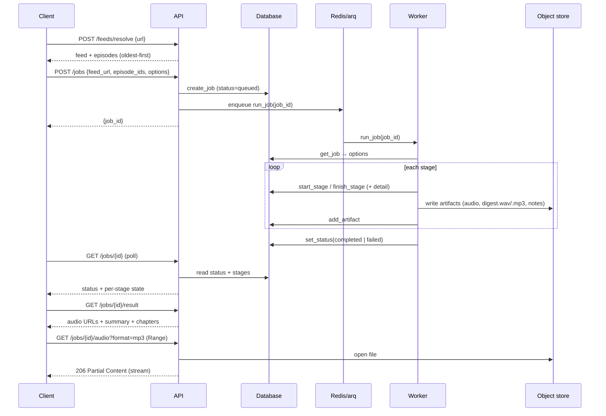
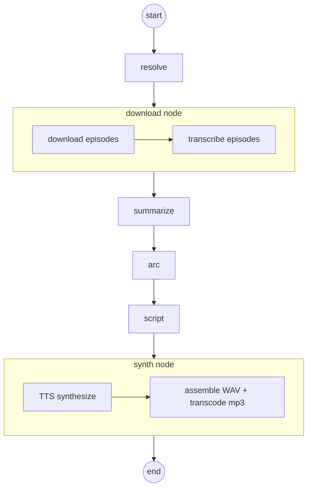

# Podcast Compactor — System Architecture Reference

A detailed, whole-system reference for how Podcast Compactor is built: its
components, the job lifecycle, the processing pipeline, the ports/adapters seams,
persistence, the HTTP API, configuration, execution model, and deployment.

For the narrative overview and quickstart, see the [README](../README.md). For the
per-feature designs and build plans, see [`superpowers/specs/`](superpowers/specs/)
and [`superpowers/plans/`](superpowers/plans/).

---

## 1. Purpose & scope

Podcast Compactor turns a podcast — or a chosen chronological stretch of it — into
a single digest episode. A user pastes a podcast link, picks which episodes to
include (oldest-first), and the service:

1. resolves the link to an RSS feed and lists episodes,
2. downloads the selected episodes' audio,
3. transcribes them (speech-to-text),
4. summarizes each episode (LLM "map"),
5. synthesizes a single chronological narrative arc across them (LLM "reduce"),
6. writes a spoken script sized to a target duration,
7. synthesizes narration with text-to-speech, and
8. assembles a `digest.wav` + a compressed `digest.mp3` plus show notes (summary +
   chapter markers).

It is a **backend service with an HTTP API**, not a CLI. Three job modes are
supported: single-narrator (default), two-host dialogue (`host_count=2`), and
opt-in voice **cloning** (`clone=true`) with mandatory guardrails.

---

## 2. High-level architecture

```mermaid
flowchart LR
    subgraph clients[Clients]
        web[Web UI]
        mobile[Mobile app]
    end

    subgraph api[FastAPI service]
        direction TB
        auth[Bearer-token auth]
        routes[Routes: feeds, jobs, audio, health]
    end

    redis[(Redis / arq queue)]
    db[(SQL DB: SQLite dev / Postgres prod)]
    fs[(Object store: local filesystem / S3 later)]

    subgraph worker[arq worker]
        graph[LangGraph pipeline]
    end

    web & mobile -->|HTTPS + Bearer| api
    api -->|create job| db
    api -->|enqueue job_id| redis
    api -->|stream WAV/mp3| fs
    redis --> worker
    worker -->|read job/options| db
    worker -->|per-stage progress + artifacts| db
    worker -->|write audio, transcripts, outputs| fs
    api -->|poll status / result| db
```

**Two processes, shared state.** The API and the worker are separate processes
that never call each other directly — they communicate through the **queue**
(hand off a `job_id`), the **database** (job/stage/artifact state), and the
**object store** (audio + outputs). This lets the long, GPU-bound pipeline run
independently of request/response latency, and lets the API stay a thin,
stateless HTTP layer.

---

## 3. Job lifecycle



Progress is **polled**, not pushed: the worker persists per-stage state as it
goes, and clients read `GET /jobs/{id}`. There is intentionally no SSE/WebSocket
(single-user MVP; easy to add later).

---

## 4. The processing pipeline

The pipeline is a LangGraph `StateGraph` compiled from node closures over a
`Deps` container (`pipeline/graph.py`, `pipeline/nodes.py`). It is **linear**:



Six graph nodes cover eight tracked **stages** (`models/enums.py:StageName`): the
`download` node runs both `download` and `transcribe`; the `synth` node runs both
`tts` and `assemble`. (`StageName.LIST` exists for an interactive selection step;
today selection happens at job creation via `episode_ids`, so it is unused.)

Data threaded through the graph (`pipeline/state.py:PipelineState`):

| Stage | Input | Output (state key) | Notes |
|---|---|---|---|
| resolve | `feed_url`, `episode_ids` | `feed`, `selected` | resolver → RSS → parse → filter to selected |
| download | `selected` | `transcripts` | per-episode; failures are recorded and skipped |
| summarize | `transcripts` | `summaries` | LLM **map**, one `EpisodeSummary` per episode |
| arc | `summaries` | `arc` | LLM **reduce** → one `ArcOutline` |
| script | `arc`, `options` | `script` | LLM; retries/expands to meet the word budget |
| synth | `script`, `arc` | `output_uri` | TTS per segment → assemble → transcode |

**Resilience.** Per-episode download/transcribe errors are appended to the job
`report.skipped` and the run continues; a stage only fails if *every* episode
fails. Each node wraps its work in `start_stage`/`finish_stage`, so a failure is
recorded against the exact stage before the exception propagates and the job is
marked `failed`.

**Checkpointing.** `build_graph` compiles with an in-memory `MemorySaver` by
default; a durable (e.g. Postgres-backed) saver is the intended production swap so
a crashed job can resume from its last completed stage.

---

## 5. Ports & adapters

Every external or heavy dependency sits behind a small `Protocol` **port** with a
real adapter and a test **fake**. This is what lets the entire pipeline run on CPU
with no network, GPU, or ffmpeg in the test suite, and what isolates provider SDKs
from the pipeline logic.

| Port (protocol) | Method(s) | Real adapter | Fake |
|---|---|---|---|
| `Resolver` | `matches`, `resolve` | `Apple`/`Castbox`/`RawRss` resolvers | (registry, no fake needed) |
| `Transcriber` (STT) | `transcribe(path) -> Transcript`, `release()` | `FasterWhisperTranscriber` (CTranslate2) | `FakeTranscriber` |
| `StructuredLLM` | `generate(system, user, schema) -> BaseModel` | `AnthropicStructuredLLM`, `OllamaStructuredLLM` | `FakeStructuredLLM`, `LocalStubLLM` |
| `TTS` | `synthesize(text, voice) -> wav bytes`, `release()` | `F5TTS` (zero-shot) | `FakeTTS` (silent WAV sized to word count) |
| `VoiceCloner` | `clone(audio_paths, keys, storage, job_id) -> {key: Voice}` | `PyannoteVoiceCloner` (diarization) | `FakeVoiceCloner` |
| `Watermarker` | `embed(wav) -> wav` | `AudioSealWatermarker` | `FakeWatermarker` (no-op) |
| `Transcoder` | `to_mp3(src_wav, dst_mp3)` | `FfmpegTranscoder` (subprocess ffmpeg) | `FakeTranscoder` (stub bytes) |
| `Storage` | `put_bytes/get_bytes/put_file/local_path/exists` | `FilesystemStorage` | (real fs under `tmp_path` in tests) |

Ports and their fakes live in `ports/` (and `storage/base.py`); real ML adapters
live in `transcribe/`, `synth/`, and `ports/llm.py`. **GPU models expose
`release()`** so the pipeline can free one model's VRAM before loading the next
(see §9).

Convention: a port's `Protocol` and its `Fake*` sit together in `ports/`; the real
adapter lives next to its domain (`transcribe/faster_whisper.py`,
`synth/f5_tts.py`, `synth/transcode.py`, …).

---

## 6. Domain model

The pydantic models in `models/domain.py` are the vocabulary that flows through
the pipeline (distinct from the SQLAlchemy persistence models in `models/db.py`):

- **`Episode` / `Feed`** — parsed RSS; episodes are oldest-first with an
  `order_index` and a `is_short_or_trailer` flag.
- **`Transcript` / `TranscriptSegment`** — time-stamped STT output; `.text` joins
  segments.
- **`EpisodeSummary`** — the map-step output (key points, themes, quotes, timeline
  markers).
- **`ArcOutline` / `ArcBeat`** — the reduce-step chronological through-line.
- **`Script` / `ScriptSegment`** — speaker-attributed spoken text; `.word_count`
  and `.estimated_minutes(wpm)` drive budget sizing.
- **`ShowNotes` / `Chapter`** — the human-readable output (summary + chapter
  markers, `synthetic` flag + `disclaimer` for cloned output).
- **`JobOptions`** — per-run choices: `episode_ids`, `host_count`, `clone`,
  `target_minutes`.

---

## 7. Persistence & job state

SQLAlchemy models (`models/db.py`), accessed only through `JobRepository`
(`persistence/repo.py`) so the pipeline and API never touch sessions directly:

- **`Job`** — `id`, `feed_url`, `status`, `current_stage`, `options_json`,
  `report_json`, `created_at`, `finished_at`.
- **`StageStatus`** — one row per stage attempt: `stage`, `state`, `detail`,
  `started_at`, `finished_at`.
- **`Artifact`** — produced files: `kind`, `uri`, optional `episode_guid`.

`JobRepository` methods: `create_job`, `get_job` (eager-loads stages/artifacts then
detaches), `list_jobs(limit, offset) -> (jobs, total)`, `set_status`,
`start_stage`/`finish_stage`, `add_artifact`, `set_report`. `JobStatus` moves
`queued → running → completed | failed`; `StageState` is
`pending → running → done | skipped | failed`.

The engine is created from `DATABASE_URL` — **SQLite** for local dev
(`sqlite:///./data/app.db`), **Postgres** for production
(`postgresql+psycopg://…`). `init_db` creates tables from the metadata.

---

## 8. HTTP API surface

FastAPI app built by `create_app(repo, resolve_fn, http, enqueue, storage,
settings)` (`api/app.py`); the composition root is `build_default_app`
(`uvicorn --factory`). Every route except `/health` is guarded by the bearer
dependency (`api/auth.py`); CORS is configured from `cors_allow_origins`.

| Method | Path | Purpose |
|---|---|---|
| GET | `/health` | Unauthenticated liveness probe |
| POST | `/feeds/resolve` | Resolve a link → feed title + episodes |
| POST | `/jobs` | Create a job (`JobOptions`) and enqueue it |
| GET | `/jobs` | Paginated job history (`limit`, `offset`) |
| GET | `/jobs/{id}` | Status + per-stage state (poll this) |
| GET | `/jobs/{id}/result` | `audio_mp3_url`, `audio_wav_url`, summary, chapters |
| GET | `/jobs/{id}/audio?format=mp3\|wav` | Range-streamed audio |

Audio is served via Starlette `FileResponse`, which emits `Accept-Ranges` and
answers `Range:` with `206 Partial Content` (seek/scrub). Result/audio URLs are
**relative** so web and mobile clients just prefix their base URL.

**Error map:** `401` (missing/bad token), `404` (unknown job / missing rendition),
`409` (result/audio requested before completion), `416` (bad Range), `422`
(malformed body / bad `format`), `502` (upstream feed fetch failed).

---

## 9. GPU & resource management

Real runs are GPU-bound and VRAM-constrained (validated on an 8 GB RTX 4060).
Three mechanisms keep peak VRAM to the single largest model rather than the sum:

- **Lazy load + `release()` between stages.** `FasterWhisperTranscriber` and
  `F5TTS` load on first use; the pipeline calls `release()` in `finally` blocks
  after transcribe and after synthesis, and a shared `gpu.empty_cuda_cache()`
  drops cached blocks.
- **Ollama `keep_alive=0`.** The local LLM is unloaded from VRAM as soon as a call
  returns, instead of lingering the default 5 minutes.
- **CUDA-12 cuBLAS preload.** `FasterWhisperTranscriber` preloads the CUDA-12
  cuBLAS/runtime libraries so CTranslate2 works under a CUDA-13 PyTorch build with
  no `LD_LIBRARY_PATH` juggling.

On 8 GB, use `WHISPER_MODEL=small` (large-v3 will not fit beside F5-TTS). The
script writer under-budgets on small local models; a larger/general instruct model
narrates closer to the target length.

---

## 10. Job modes

| Mode | Trigger | Behaviour |
|---|---|---|
| Single narrator | default (`host_count=1`) | One `narrator` voice; all segments normalized to it. |
| Two-host dialogue | `host_count=2` | Two speakers `host_a`/`host_b`; each needs a stock reference clip in real mode. |
| Voice cloning | `clone=true` | Clones the original hosts' voices from the episodes via diarization. |

**Cloning guardrails (always enforced, non-optional):** the output is labeled
`synthetic: true` with a disclaimer in the show notes, a **spoken disclaimer** (in
a non-cloned voice) is prepended to the audio, and the audio is **watermarked**
(AudioSeal). Real cloning needs the `[gpu]` extra and an `HF_TOKEN` for pyannote.

---

## 11. Configuration

All config is environment-driven via pydantic-settings (`config.py`, `.env`):

| Setting | Default | Purpose |
|---|---|---|
| `USE_FAKES` | `true` | Fakes for STT/LLM/TTS — CPU-only, no network. Set `false` on a GPU host. |
| `DATABASE_URL` | SQLite `./data/app.db` | Metadata store; Postgres in prod. |
| `REDIS_URL` | `redis://localhost:6379` | arq job queue. |
| `DATA_DIR` | `data` | Root of the object store (use an absolute path in real runs). |
| `API_TOKEN` | unset | When set, bearer token required on all routes but `/health`. |
| `CORS_ALLOW_ORIGINS` | `["*"]` | Allowed web/mobile origins (JSON list). |
| `LLM_BACKEND` | `anthropic` | `anthropic` (needs `ANTHROPIC_API_KEY`) or `ollama`. |
| `OLLAMA_MODEL` / `OLLAMA_BASE_URL` | `qwen2.5-coder:7b` / localhost | Local model + endpoint. |
| `WHISPER_MODEL` | `small` | faster-whisper size (`small` fits 8 GB beside F5-TTS). |
| `MAP_MODEL` / `REDUCE_MODEL` | Haiku / Opus | Claude models (ignored on Ollama). |
| `WPM` | `130` | Words/minute used to size the script to `target_minutes`. |
| `*_REF_AUDIO` / `*_REF_TEXT` | unset | Reference clips for narrator / host_a / host_b. |
| `CLONE_DISCLAIMER` / `HF_TOKEN` | default text / unset | Cloning disclaimer + pyannote token. |

Composition roots read settings and wire dependencies: `worker/main.py:build_deps`
(pipeline, fakes vs real) and `api/app.py:build_default_app` (API).

---

## 12. Storage & artifact layout

`FilesystemStorage` writes blobs under `DATA_DIR/<key>`; `local_path` exposes a
real path for tools that need a file on disk (ffmpeg, model loaders, `FileResponse`).

```
data/
  app.db                                  # SQLite (dev)
  <job_id>/
    audio/<order_index>.mp3               # downloaded source episodes
    refs/<speaker_key>.wav                # cloning reference clips (clone mode)
    output/
      digest.wav                          # assembled narration
      digest.mp3                          # compressed rendition (served to clients)
      show_notes.json                     # summary + chapters
      script.json                         # the spoken script
```

Artifact `kind`s recorded in the DB: `audio_download`, `reference_clip`,
`output_audio`, `output_audio_mp3`, `show_notes`, `script`.

---

## 13. Execution & deployment topology

- **Processes:** an API (`uvicorn --factory podcast_compactor.api.app:build_default_app`)
  and one or more arq workers
  (`arq podcast_compactor.worker.main.WorkerSettings`), plus Redis and a SQL DB.
  `docker-compose.yml` provides Redis (+ optional Postgres) for local runs.
- **Scaling:** the API is stateless and horizontally scalable; workers scale with
  GPU availability (the pipeline is the bottleneck). Job handoff is via Redis, so
  workers can live on the GPU host while the API runs elsewhere.
- **Today's single-user reality:** SQLite + local filesystem + one GPU box, guarded
  by a shared `API_TOKEN`. The seams below make the production shape a drop-in swap.

---

## 14. Extension points (designed-for, not yet wired)

- **Object storage → S3.** `Storage` is a port; the audio endpoint is the only
  filesystem-coupled consumer and is isolated in `api/audio.py` (it becomes a
  redirect to a pre-signed URL).
- **Durable checkpointer → Postgres.** `build_graph` accepts a `checkpointer`; a
  Postgres saver enables crash-resume.
- **Multi-user accounts.** Auth is a single dependency (`make_require_token`);
  per-user ownership would extend `Job` + the repo queries.
- **Live progress → SSE/WebSocket.** Progress is already persisted per stage; a
  push channel is additive.
- **Web & mobile clients.** They consume this API directly; the relative audio
  URLs and CORS/auth settings exist for exactly that.

---

## 15. Testing strategy

- **Fakes by default.** `USE_FAKES=true` and per-port fakes let `uv run pytest`
  run the whole pipeline and API on CPU with no network, GPU, or ffmpeg.
- **Unit tests** cover each port/fake, the script budget loop, auth, `list_jobs`,
  and the range-served audio endpoint (`200`/`206`/`416`/`404`/`409`).
- **Integration tests** drive the full LangGraph end-to-end with fakes and assert
  the produced artifacts (including `digest.mp3`), GPU `release()` ordering, and
  the two-host / cloning flows.
- **Real adapters** are exercised opt-in (e.g. the ffmpeg transcode test is
  `skipif` ffmpeg is absent); GPU backends are validated manually on a GPU host.

---

## 16. Module map

| Path | Responsibility |
|---|---|
| `api/` | FastAPI app, request/response schemas, auth dependency, audio streaming |
| `ingest/` | Link → RSS resolvers, feed parsing, episode download |
| `transcribe/` | faster-whisper STT adapter |
| `summarize/` | map/reduce LLM chains + prompts |
| `script/` | script writer (budget-aware) |
| `synth/` | F5-TTS, assembly, ffmpeg transcode, cloning, watermarking |
| `ports/` | Port protocols + fakes (STT, LLM, TTS, cloner, watermarker, transcoder) |
| `storage/` | Storage port + filesystem implementation |
| `pipeline/` | LangGraph graph, node closures, state + `Deps` |
| `persistence/` | SQLAlchemy models access via `JobRepository`, engine helpers |
| `worker/` | arq worker + `build_deps` composition root + `run_pipeline` |
| `models/` | pydantic domain models, SQLAlchemy db models, enums |
| `config.py` | pydantic-settings configuration |
